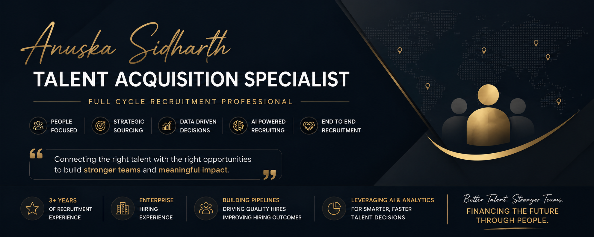

  

# Hi, I'm Anuska Sidharth 👋

### AI-Enabled Talent Acquisition | Full Cycle Recruiting | Boolean Search | Market Intelligence

3 years of full cycle recruiting experience across IT and non-IT hiring, now focused on building AI-powered workflows, sourcing systems, and recruiting analytics that make hiring faster and more data-driven.

This GitHub is a working portfolio, not a resume. Every repository below is something I actually use or built to solve a real recruiting problem.

> AI should enhance recruiter judgment, not replace it. Every tool in this portfolio is built with a human checkpoint in mind.

---

## Portfolio Snapshot

📂 7 Repositories
🤖 AI Recruiting Workflows and Live Tools
📊 Talent Mapping and Market Research
📈 Power BI Recruitment Analytics Dashboard
🔍 Boolean Search Library
📝 Recruitment Templates
📚 Professional Certifications
📄 Resume

---

## Featured Repositories

### 🤖 [AI-for-Talent-Acquisition](https://github.com/anuskasidharth-a11y/AI-for-Talent-Acquisition)
AI powered recruiting workflows, prompt engineering, automation concepts, and practical use cases for modern Talent Acquisition. Includes end to end pipelines from job description to boolean search, resume screening, and outreach, plus three live AI tools and a full knowledge base on responsible AI use.

Highlights: AI Workflows (JD to Boolean, Resume to Shortlist, Outreach to Response) · Live Tools (boolean generator, outreach message generator, resume screener) · Prompt Library · Case Studies · Resources and Best Practices

---

### 📊 [Talent-Mapping-Market-Research-Market-Intelligence](https://github.com/anuskasidharth-a11y/Talent-Mapping-Market-Research-Market-Intelligence)
A practical talent acquisition portfolio showcasing talent mapping, market research, competitor analysis, and strategic sourcing frameworks for data driven hiring, backed by three full case studies including passive talent pipelines and enterprise hiring strategy for technology workforce.

Highlights: Talent Mapping · Market Intelligence Tracker · Recruitment Market Research · Case Studies · Hiring Manager and Screening Templates

---

### 🔍 [boolean-search-library](https://github.com/anuskasidharth-a11y/boolean-search-library)
A practical Boolean Search Library for recruiters, organized by function and tech stack, containing LinkedIn searches, Google X-Ray searches, and quick reference cheat sheets.

Highlights: LinkedIn Boolean by Domain (.NET, Cloud & DevOps, Data & AI, HR & Recruitment, Java, Product & Business, Python, QA & Testing, Sales & Marketing) · Google X-Ray Searches · Recruiting Guides and Cheat Sheets

---

### 📈 [Enterprise-Recruitment-Analytics-Dashboard](https://github.com/anuskasidharth-a11y/Enterprise-Recruitment-Analytics-Dashboard)
Interactive Power BI dashboard for enterprise recruitment analytics featuring hiring funnel analysis, recruiter performance, sourcing insights, diversity metrics, and DAX calculations for executive HR reporting.

Highlights: Power BI Dashboard · Recruitment Dataset · Hiring Funnel Analysis · Recruiter Performance · Diversity Metrics

---

### 📝 [Recruitment-Templates](https://github.com/anuskasidharth-a11y/Recruitment-Templates)
Professional recruitment templates covering the full candidate lifecycle, from first outreach through offer and joining day.

Highlights: Candidate Outreach (LinkedIn, Cold Email) · Hiring Manager Collaboration (Intake Meetings, Weekly Updates) · Offer Management and Candidate Care (Offer Release, Joining Day, Pre-Joining Check-ins)

---

### 📚 [Professional-Certifications](https://github.com/anuskasidharth-a11y/Professional-Certifications)
Professional certifications, learning journey, and key takeaways in Talent Acquisition and HR Technology.

Highlights: AI Certifications · Recruiting and HR Learning · Analytics Coursework

---

### 📄 [Resume](https://github.com/anuskasidharth-a11y/Resume)
Professional resume and supporting documents.

---

## Skills

**Talent Acquisition**
Full Cycle Recruiting · Candidate Sourcing · Screening · Boolean Search · Stakeholder Management · Employer Branding

**AI**
ChatGPT · Claude · Gemini · Perplexity · Prompt Engineering · AI-Assisted Workflow Design

**Research**
Talent Mapping · Market Research · Competitive Intelligence · Salary Benchmarking

**Analytics**
Power BI · Excel · DAX · Recruitment Metrics and KPI Reporting

---

## Currently Exploring

AI Agents for Recruiting · Workflow Automation · MCP · Advanced Prompt Engineering · RAG and Vector Databases

---

## Philosophy

> Great recruiting is powered by people. AI accelerates the process, but empathy, judgment, and relationships remain at the heart of successful hiring.

---

## Let's Connect

📍 India
💼 [LinkedIn](https://www.linkedin.com/in/anuska-sidharth-0652b91b4)

📧 [anuskasidharth@gmail.com](mailto:anuskasidharth@gmail.com)

Open to conversations about Talent Acquisition, AI in Recruiting, and Recruitment Operations.
**LinkedIn**

www.linkedin.com/in/anushka-sidharth-0632b91b4
